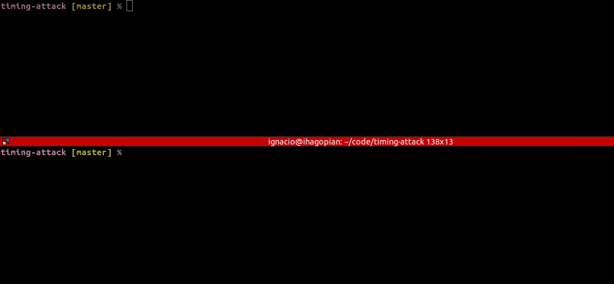

# Timing-attack

[Timing-attack](https://en.wikipedia.org/wiki/Timing_attack) is a proof of concept of a type of side-channel attack where time metadata is use to leak information about executions. In particular, network API calls are explored to identify tiny latencies variations to assert with high-confidence some facts about different request cases.

# Design
This proof of concept is separated in two parts: _server_ and _attacker_.

## Server
The _server_ is a simple webserver mock which simulates an API login, where first the user is retrieved by email from a database, and if exists a password checksum is done. The database query and the checksum comparation are mocked by different `time.Sleep` calls with reasonable order-magnitude values.

Also, base-latencies and standard-deviation values can be configured to add noise to the total request latency to make it more realistic.

## Attacker
The _attacker_ is a tool which compares a base and target cases. Both targets are analyzed for statistical differences in they mean latencies. A statistical-meaningful mean latency difference might imply both cases run different code paths in the server. The attacker gathers data by making request to the server with certain concurrency level (default 8).

Currently, a live confidence interval at 95% is shown for each case (base and target). These confidence-intervals are shown live while more request (thus, data) is being gathered by the attacker. Eventually if bot confidence intervals are disjoint, we can be reasonably sure that the mean latency for each base and target cases are different.

# Demo

# Further work
This is just an initial exploration/play with the problem. 

Further work might involve:
- calculate p values for base vs target case
- improve configurability of confidence-interval %
- automatic stop when reasonable conclusion can be found
- more modularization between data gathering, analysis, and visualization
- automatic concurrency decision (more concurrency, more jitter)
- graphs with data
- rate limiting
- pair sampling analysis
- exploration of network latency models

# License
timing-attack is licenced under the [MIT license](https://github.com/jsign/timing-attack/blob/master/LICENSE).
